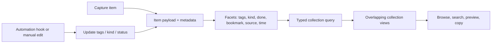

# Collections and organization plan

## Context

- ShiftShift captures short pieces of text, links, todos, and images into one
  `Item` store. An item currently has `kind`, `done`, `bookmarked`, `rank`,
  `source_app`, `created_at`, and copy-history statistics.
- Browsing already has built-in views for recent, bookmarked, images, and
  todos, plus text, `@` metadata filters, and inline `#hashtag` filters.
- Hashtags remain readable from legacy `Item.text` values for compatibility,
  but tags are now also stored as first-class `Item.tags` metadata. New UI and
  automation changes write metadata, and app-initiated copies exclude both
  metadata and legacy hashtag tokens.
- Storage is behind a Rust `Store` port with local SQLite, a folder backend,
  and an S3-compatible backend. The folder and S3 formats use serialized item
  objects, so a new organization model must remain portable across all three.
- Preferences and automation hooks belong in the JSON settings/config export.
  Collections describe user data and should travel with the selected item
  backend instead of living only in local settings.
- External automation hooks run after item lifecycle events. Version 1 can set
  kind, done state, bookmark state, and tags, and can contribute portable
  faceted views. This makes metadata-driven
  organization useful before an in-app LLM integration exists; see
  [`AUTOMATIONS.md`](../AUTOMATIONS.md).

## Goal

Organize entries into overlapping, saved contexts that are fast to use at
capture time, friendly to automation, and portable across backends without
forcing every entry into a filesystem-like tree.

The recommended product model is **faceted entries plus smart collections**:
tags and other metadata describe an item, while a collection is a named saved
view that selects matching items. An item can appear in many collections
without being moved or duplicated.

## What

Build collections as saved, typed queries over item metadata rather than as
folders containing item IDs.

Each item should eventually have these independent facets:

- content text and kind (`note`, `todo`, `link`, or `image`);
- normalized first-class tags, such as `work`, `project:website`, or
  `read-later`;
- status (`done`), bookmark state, source app, and timestamps;
- future facets such as due date, priority, archive state, or an integration
  reference when those concepts are introduced.

A collection should contain a name, presentation details, a typed query, and
its preferred sort order. Its membership is computed when the view is read.
The first version should support predicates combined as `all`, `any`, and
`none`, for example:

```json
{
  "id": "work-queue",
  "name": "Work queue",
  "query": {
    "all": [
      { "field": "tag", "operator": "equals", "value": "work" },
      { "field": "kind", "operator": "equals", "value": "todo" },
      { "field": "done", "operator": "equals", "value": false }
    ],
    "any": [],
    "none": []
  },
  "sort": "newest"
}
```

The current built-in tabs become built-in collections or collection-like
views: All, Recent, Bookmarked, Todos, Images, Links, and Untagged. Custom
collections are displayed alongside them, but are not nested in one another.

## Why

A filesystem tree makes the user choose one location before capture. It also
forces moves and renames, makes an entry difficult to use in two contexts, and
turns automation into a sequence of brittle file-routing rules. That is a bad
fit for a capture tool where the first goal is to save something quickly and
decide what it means later.

Tags alone are flexible but become an uncurated pile of labels. Collections
provide the missing layer: a small number of named, useful views over those
labels and the existing status/type metadata. This gives the user the feeling
of having projects, queues, and reference shelves without imposing a single
hierarchy.

## How

### Conceptual model

An item has one payload and many independent facts. Collections are lenses over
those facts, not containers that own the item.



The important relationship is many-to-many in behavior: one item may match
`Work queue`, `Urgent`, and `Recently captured` at the same time. Nothing is
copied and no physical file is moved.

### Operations / behavior

- Create a collection from scratch or save the current filter as a
  collection.
- Name, rename, reorder, recolor, and delete collections. Deleting a
  collection never deletes its matching items.
- Build a query from supported facets using `all`, `any`, and `none` groups.
- Select a collection and continue typing a temporary text filter. The
  temporary filter is combined with the collection query using `AND` and does
  not change the saved definition.
- Edit a collection later and see its count update as items change.
- Show which collections match the selected item, where useful in the detail
  view or command palette.
- Add or remove a tag from an item. Renaming a tag updates all items using it;
  deleting a tag removes only that metadata.
- Let an automation add metadata. Matching collections update automatically,
  so a future `add_to_collection` action is not needed for normal routing.
- Export and import collection definitions with the content/data export. Keep
  secrets and machine preferences in the settings export only.

### Tech choices

| Choice | Decision | Rationale |
|--------|----------|-----------|
| Folders/tree vs smart collections | Smart collections | Entries can belong to multiple contexts and capture does not require a placement decision. |
| Inline tags vs first-class tags | First-class tags with a legacy migration | Tags are organization metadata, so editing or copying the payload should not modify or include them. |
| Free-form query text vs typed query AST | Typed JSON query AST | It is portable across SQLite, folder, and S3 storage; it is safe to validate; and it keeps all backends semantically consistent. |
| Dynamic membership vs item-to-collection links | Dynamic membership first | Tags and metadata are enough for automatic routing and avoid stale membership records. |
| Settings vs item backend for collection storage | Item backend | Collection definitions are user data that should sync with the entries they organize, not remain local to one machine. |
| SQL queries vs one evaluator per UI/backend | One shared evaluator at the application/store boundary | A single implementation avoids subtle differences between local, folder, S3, and client-side filtering. It can be optimized later without changing the query format. |

### Architecture

```text
capture / edit / automation
          |
          v
  Item { text, tags, kind, status, source, timestamps }
          |
          +--> active Store backend
          |       - SQLite: items + collections tables
          |       - Folder: item JSON + collection JSON
          |       - S3: item objects + collection objects
          |
          v
  CollectionQuery evaluator
          |
          +--> built-in views
          +--> saved smart collections
          +--> temporary text filter and sort
          |
          v
       list UI / command palette / preview
```

The frontend should receive a stable collection/query representation through
the existing Tauri RPC boundary. For the first slice, evaluating against the
already loaded item list is acceptable; the query format and semantics should
still live in one shared implementation so a future backend can evaluate
queries without changing the UI.

## What this allows

- A `Work queue` collection can be `tag:work + kind:todo + done:false`.
- A `Read later` collection can be `kind:link + tag:read-later`.
- A `Project launch` collection can use several project tags and exclude
  `done:true` without moving entries.
- An LLM hook can classify a capture and add up to a few canonical tags; the
  appropriate collections pick it up immediately.
- The same entry can be visible in a project view, a priority view, and a
  recent-captures view.
- Collection definitions can sync through local folder, iCloud Drive, S3, or a
  future backend using the same logical format.
- Users can start with built-in views and add structure gradually instead of
  designing a taxonomy before capturing anything.

## What this does not allow

- An entry does not have one exclusive parent collection.
- V1 does not move, copy, or rename files when a collection changes.
- V1 does not support arbitrary nested folders or a filesystem tree.
- V1 does not persist a separate membership row for every item/collection
  match.
- V1 does not expose arbitrary SQL or executable query expressions to users or
  automation hooks.
- A collection does not silently mutate items merely because it is selected;
  changing metadata remains an explicit user action or an enabled automation.
- An LLM is not required. Deterministic filters and manual tags remain fully
  usable when no model or external hook is configured.

## UI & UX

### Desktop

Keep the fast, chip-like built-in views, then add a clearly separated custom
collections section rather than turning the app into a file browser:

```text
[Recent] [Bookmarked] [Todos] [Images] [Links] [Untagged]

COLLECTIONS                                  [+ New]
  Work queue                         12
  Read later                          8
  Project launch                      4

                         [entry list]
  Filter / command / add a note
```

`+ New` opens a small builder. It should offer “Save current filter” as the
fast path, then allow adding clauses by selecting a facet, operator, and
value. The builder previews the number of matching items before saving.

The collection list should be reorderable, but entries keep their existing
global rank unless a future curated collection needs its own ordering. Counts
are helpful but must not cause the list to jump while typing; preserve the
current filter input and selected collection when item metadata changes.

### Mobile

There is no mobile client in the current product scope. The data model should
remain mobile-friendly: use a horizontal collection picker or a single
collection menu, and keep the same saved query definitions rather than
introducing a mobile-only hierarchy.

### Common interactions

| Action | Result |
|--------|--------|
| Select a built-in or custom collection | The list shows matching items and retains the active text filter. |
| Choose “Save current filter” | A new collection is prefilled with the current typed/filter clauses. |
| Click `+ New` | Opens the query builder without changing the current list. |
| Edit a collection | Saves its definition and refreshes the match count/list. |
| Delete a collection | Removes only the saved view; all items remain untouched. |
| Add a tag manually or via automation | Items enter/leave matching collections automatically. |
| Copy an item from a collection | Copies the item payload only; collection labels and tags are UI metadata. |
| Open the command palette on a collection | Offers select, edit, duplicate, and delete actions subject to the same confirmation rules as the UI. |

## Data model

The logical model is shown below. `COLLECTION ..> ITEM` is a computed match,
not a stored foreign-key membership table.

```mermaid
erDiagram
    ITEM {
        string id PK
        string text
        string kind
        string[] tags
        boolean done
        boolean bookmarked
        float rank
        string source_app
        datetime created_at
    }
    COLLECTION {
        string id PK
        string name
        json query
        string sort
        float rank
        string icon
        string color
        datetime created_at
        datetime updated_at
    }
    COLLECTION ..> ITEM : "matches at read time"
```

Recommended first implementation details:

- Add `tags: Vec<String>` / `tags: string[]` to `Item`, defaulting to an empty
  list. Persist the same serialized field in SQLite, folder JSON, and S3 JSON.
  SQLite can begin with a JSON string column; normalize it into tag and
  item-tag tables only if indexing becomes necessary.
- Add a `Collection` record with a stable UUID, display name, optional icon and
  color, sidebar rank, sort mode, and a validated `CollectionQuery`.
- Represent predicates as typed values such as `tag equals work`,
  `kind equals todo`, `done equals false`, `bookmarked equals true`,
  `source_app equals Safari`, `text contains invoice`, and date comparisons.
  Do not store raw SQL or arbitrary code.
- Store collections in SQLite as a `collections` table. For folder and S3
  backends, use a reserved collections area with one JSON object per
  collection, matching the existing portable item shape.
- Keep preferences, hook commands, and machine-specific paths in settings;
  keep item tags and collection definitions in the selected data backend.
- Treat existing inline hashtag tokens as legacy metadata for compatibility;
  the current implementation reads them for matching and copy filtering while
  new edits write `Item.tags`. A physical migration can be added later with a
  parser shared by all backends, preserving code blocks, URLs, Markdown, and
  ordinary prose.
- Update automation `add_tags` to write metadata rather than append text. New
  tags should be normalized and deduplicated at the store boundary.
- Keep the copy boundary simple: copy `Item.text` content, excluding rendered
  tag metadata and collection presentation labels.

## Implementation steps

1. Formalize tag parsing, normalization, display, and copy semantics. Add
   first-class `tags` to the shared item model and keep current inline tags
   readable as legacy metadata.
2. Extend every `Store` adapter and its serialization format for item tags and
   collection CRUD. Add SQLite migration, folder/S3 round-trip tests, and
   backup/restore coverage.
3. Define and validate `CollectionQuery` and implement one deterministic
   evaluator covering the built-in facets and `all`/`any`/`none` groups.
4. Add Tauri commands and TypeScript types for listing, creating, updating,
   reordering, and deleting collections. Preserve the current filter input and
   selection across collection/item updates.
5. Add the desktop collection picker and builder. Include “save current
   filter”, live match counts, keyboard navigation, context-menu actions, and
   command-palette actions.
6. Change automation tag actions to use first-class metadata and add examples
   for LLM classification, project routing, and follow-up detection.
7. Add content export/import for collection definitions, document backend
   sync behavior, and test migration, duplicate tags, malformed queries,
   deleted tags, and items matching multiple collections.

## Open questions

1. Should “Inbox” mean recent unreviewed items, items with no project tag, or a
   future explicit review state? Do not overload `done` or `bookmarked` to
   answer this prematurely.
2. When users need a fixed reading list, should we add a second curated
   collection type with explicit membership and per-collection ordering, or
   can a tag plus a smart collection cover it?
3. Do we want archive/snooze, due dates, and priority before shipping the
   collection builder, or can collections start with the current facets?
4. Should collection predicates support tag prefixes such as `project:*` in
   v1, or should exact tags remain the only matching operation initially?
5. How should two devices handle concurrent edits to a collection definition
   when using a shared remote backend? The current remote store has a
   single-writer assumption.
6. Should users be able to group collections visually without making groups
   part of the nesting/data model?

## Acceptance criteria

- [ ] A user can create, edit, reorder, and delete a named smart collection
      without changing or deleting any item.
- [ ] A collection query can combine tag, kind, done, bookmark, source, text,
      and time predicates with `all`, `any`, and `none` semantics.
- [ ] An item may match multiple collections simultaneously, and adding or
      removing metadata updates those views without moving or duplicating the
      item.
- [ ] Existing inline tags migrate without losing user content, and new tags
      are stored separately from the copied item payload.
- [ ] Copying from any collection copies only the entry text/content; it does
      not include collection names, tag pills, or other surrounding UI.
- [ ] Built-in views continue to work, and saving a filter preserves the
      filter input and selected view after updates.
- [ ] Collection definitions round-trip through SQLite, folder, and S3 data
      formats and are included in content export/import.
- [ ] Automation can add tags and change kind/status without blocking capture;
      matching collections update automatically.
- [ ] Malformed collection definitions are rejected with a visible error and
      cannot crash or corrupt the item store.
- [ ] No LLM, external integration, or filesystem hierarchy is required for
      the feature to be useful.

## Decisions log

| Date | Decision | Rationale |
|------|----------|-----------|
| 2026-09-08 | Recommend saved smart collections over a filesystem tree | Entries can overlap contexts and capture stays frictionless. |
| 2026-09-08 | Treat tags as first-class metadata, with migration from inline hashtags | Tags should organize entries without becoming part of their copyable payload. |
| 2026-09-08 | Store collection definitions with the selected data backend | Collections organize synced user data and should travel with it; settings remain for preferences and hooks. |
| 2026-09-08 | Start with dynamic membership and defer curated/manual membership | Automation can route items by adding metadata, without stale item-to-collection links. |
| 2026-09-08 | Keep nesting and arbitrary SQL out of v1 | A small typed model is easier to understand, validate, sync, and evolve. |
